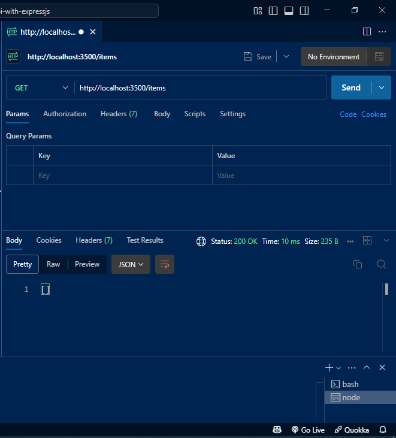
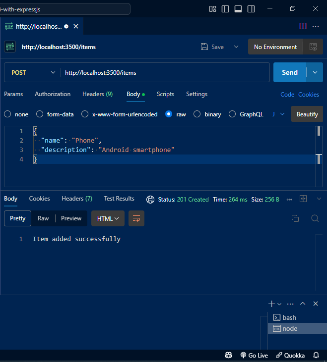
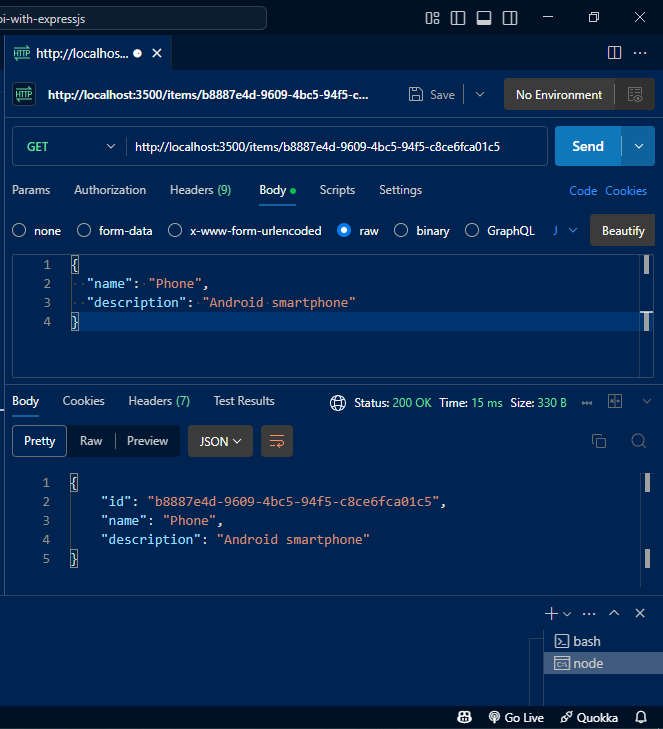
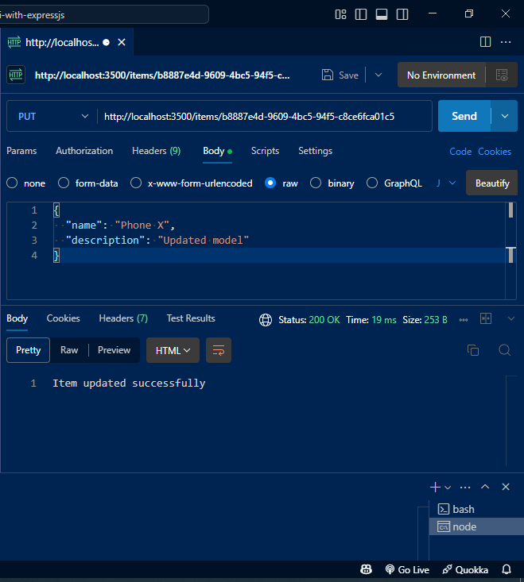
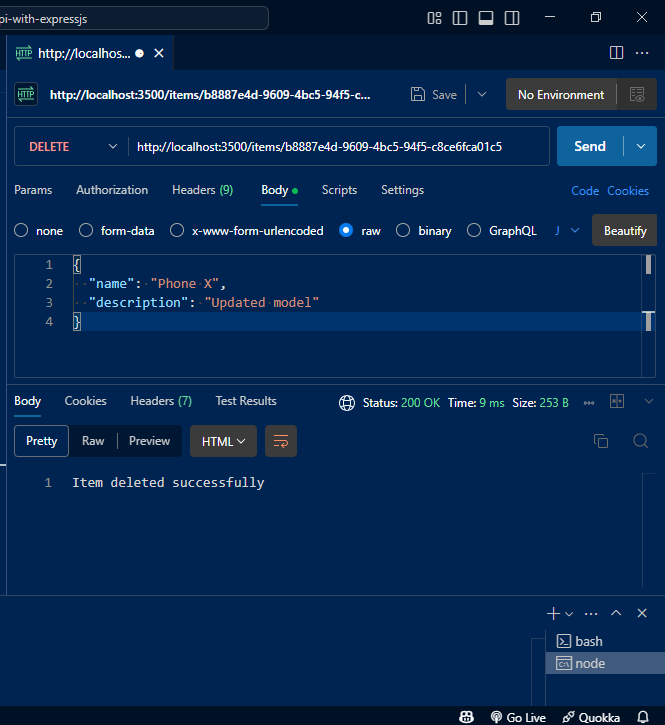

# Simple API with Express.js

## 📋 Overview

This project is a simple REST API built using Node.js and Express.js. It demonstrates the core CRUD operations (Create, Read, Update, and Delete) using an in-memory data store. It also follows RESTful principles and includes basic middleware and error handling.

## 🚀 Features

- **GET /items** – Retrieve all items
- **GET /items/:id** – Retrieve a single item by ID
- **POST /items** – Create a new item
- **PUT /items/:id** – Update an item by ID
- **DELETE /items/:id** – Delete an item by ID
- **Error Handling** – Returns appropriate status codes for invalid requests
- **Middleware** – Parses JSON body content using `express.json()`

## 🛠️ Setup Instructions

1. **Clone the repository**

   ```bash
   git clone https://github.com/techienuru/Simple-api-with-expressjs.git
   cd Simple-api-with-expressjs
   ```

2. **Install dependencies**

   ```bash
   npm install
   ```

3. **Run the application**

   ```bash
   node server.js
   ```

   Or if you have `nodemon` installed:

   ```bash
   nodemon server.js
   ```

4. **API is available at**
   ```
   http://localhost:3500
   ```

## 🗂️ In-Memory Data Storage

This project uses a simple in-memory array to store item data instead of a database. The data exists only while the server is running, and will reset once the server is restarted.

Each item in the array has the following structure:

```
  {
    id: "unique-id",
    name: "Item Name",
    description: "Item Description"
  }
```

Sample Structure:

```
let items = [
{
id: "1",
name: "Book",
description: "A hardcover notebook"
},
{
id: "2",
name: "Pen",
description: "A black ink ballpoint pen"
}
];
```

This approach is suitable for prototyping or learning purposes. For production-level applications, a persistent database (e.g., MongoDB, PostgreSQL) should be used.

## 🧪 Example Requests (Using Postman)

- **GET all items**

  ```
  GET http://localhost:3500/items
  ```

- **GET single item**

  ```
  GET http://localhost:3500/items/1
  ```

- **POST new item**

  ```
  POST http://localhost:3500/items
  Body (JSON):
  {
    "name": "New Item",
    "description": "This is a new item"
  }
  ```

- **PUT update item**

  ```
  PUT http://localhost:3500/items/1
  Body (JSON):
  {
    "name": "Updated Name",
    "description": "Updated description"
  }
  ```

- **DELETE item**
  ```
  DELETE http://localhost:3500/items/1
  ```

---

## 🧪 Proof of API Testing

Below are examples of API requests made using Postman, along with corresponding server responses.

### 1. `GET /items`

Retrieves all items (initially empty):



**Response (200)**:

```json
[]
```

---

### 2. `POST /items`

Creates a new item:



**Request Body:**:

```json
{
  "name": "Phone",
  "description": "Android smartphone"
}
```

**Response (201):**:

```
"Item added successfully"
```

---

### 3. `GET /items/:id (Not Found)`

Requesting a non-existent item:



**Response (404):**:

```
"Item doesn't exist in database."
```

---

### 4. `PUT /items/:id`

Updates an existing item:



**Request Body:**:

```json
{
  "name": "Phone X",
  "description": "Updated model"
}
```

**Response (200):**

```
"Item updated successfully"
```

---

### 5. `DELETE /items/:id`

Deletes an item:



**Response (200):**:

`"Item deleted successfully"`

---

## 📂 Project Structure

```

Simple-api-with-expressjs/
├── controllers/
│ └── items.js
├── middlewares/
│ └── errorHandler.js
├── routers/
│ └── items.js
├── server.js
├── package.json
├── README.md

```

## 📧 Author

**Ibrahim Nurudeen**
GitHub: [techienuru](https://github.com/techienuru)

```

```
